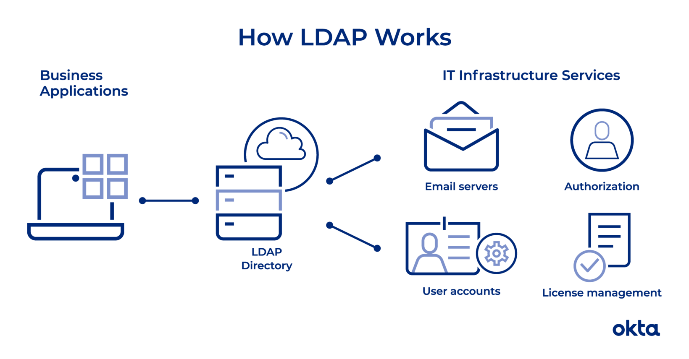

# LDAP

Lightweight directory access protocol (LDAP) is a protocol that makes it possible for applications to query user information rapidly.
Companies store usernames, passwords, email addresses, printer connections, and other static data within directories. LDAP is an open, vendor-neutral application protocol for accessing and maintaining that data. LDAP can also tackle authentication, so users can sign on just once and access many different files on the server.

*LDAP* is a protocol, so it doesn't specify how directory programs work. Instead, it's a form of language that allows users to find the information they need very quickly.

<p align="center">
    
</p>

An LDAP query typically involves:

- *Session connection*. The user connects to the server via an LDAP port. 
- *Request*. The user submits a query, such as an email lookup, to the server. 
- *Response*. The LDAP protocol queries the directory, finds the information, and delivers it to the user. 
- *Completion*. The user disconnects from the LDAP port.

Before any search commences, the LDAP must authenticate the user. Two methods are available for that work:

- *Simple*. The correct name and password connect the user to the server. 
- *Simple Authentication and Security Layer (SASL)*. A secondary service, such as Kerberos, performs authentication before the user can connect. For companies that require advanced security, this can be a good option.

## Some Terms

- *Data models*. What types of information sit within your directory? Models help you understand the facets within your LDAP. You could have general information (such as an object class), names (how each item is uniquely referenced), functions (how the data is accessed), and security (how users move through authentication).
- *Distinguished name (DN)*. This is a unique identifier of each entry that also describes location within the information tree.
- *Modifications*. These are requests LDAP users make to alter the data associated with an entry. Defined modification types include adding, deleting, replacing, and increasing.
- *Relative distinguished name (RDN)*. This is a way of tying DNs together while specifying relative location.
- *Schema*. The coding that underpins your LDAP is known as schema. You'll use this language to describe the format and attributes of each item that sits on the server.
- *URLs*. This is a string that includes the address and port of a server, along with other data that can define a group, provide a location, or refer an operation to another server.
- *Uniform resource identifier (URI)*. This is a string of characters that defines a resource.

## LDAP vs Active Directory
Active Directory is a proprietary directory tool that is used to organize IT assets, such as computers, printers, and users. As a Microsoft product, it’s commonly used within the Windows environment. If you have ever worked with Windows on a network, this system underpins some of the data.

LDAP is a protocol that can read Active Directory, but you can also use it with other programs, including those based on Linux. As a vendor-neutral protocol, you could use this tool to work with all kinds of products that have nothing to do with Windows.

Active Directory is just one example of a directory service that supports LDAP. There are other flavors, too: Red Hat Directory Service, OpenLDAP, Apache Directory Server, and more.


## LDAP Data Interchange Format (LDIF)
The LDAP Data Interchange Format (LDIF) is a standard plain text data interchange format for representing LDAP (Lightweight Directory Access Protocol) directory content and update requests. LDIF conveys directory content as a set of records, one record for each object (or entry). It also represents update requests, such as Add, Modify, Delete, and Rename, as a set of records, one record for each update request.

### LDIF fields
- *dn - distinguished name*
  - This refers to the name that uniquely identifies an entry in the directory.

- *dc - domain component*
  - This refers to each component of the domain. For example www.mydomain.com would be written as DC=www,DC=mydomain,DC=com

- *ou - organizational unit*
  - This refers to the organizational unit (or sometimes the user group) that the user is part of. If the user is part of more than one group, you may specify as such, e.g., OU= Lawyer,OU= Judge.

- *cn - common name*
  - This refers to the individual object (person's name; meeting room; recipe name; job title; etc.) for whom/which you are querying.

### Examples of LDIF
This is an example of a simple directory entry with several attributes, represented as a record in LDIF:

```ldif
dn: cn=The Postmaster,dc=example,dc=com
objectClass: organizationalRole
cn: The Postmaster
```

### From RFC2253 (UTF-8 String Representation of Distinguished Names):

| String |   X.500 AttributeType  |
|:------:|:----------------------:|
|   CN   |       commonName       |
|    L   |      localityName      |
|   ST   |   stateOrProvinceName  |
|    O   |    organizationName    |
|   OU   | organizationalUnitName |
|    C   |       countryName      |
| STREET |      streetAddress     |
|   DC   |     domainComponent    |
|   UID  |         userid         |

## OpenLDAP

OpenLDAP Software is an open source implementation of the Lightweight Directory Access Protocol.
The suite includes:
- *slapd* - stand-alone LDAP daemon (server) (local directory service)
- libraries implementing the LDAP protocol, and 
- utilities, tools, and sample clients.

slapd is an LDAP directory server that runs on many different platforms. You can use it to provide a directory service of your very own. Your directory can contain pretty much anything you want to put in it. You can connect it to the global LDAP directory service, or run a service all by yourself. 

The OpenLDAP utilities include tools for exporting data from LDAP servers to LDIF content records (ldapsearch), importing data from LDIF content records to LDAP servers (ldapadd), and applying LDIF change records to LDAP servers (ldapmodify).

### Some commands

#### Finding LDAP server configuration using ldapsearch
This command has to be run on the server directly, not from one of your LDAP clients.
```shell
ldapsearch -Y EXTERNAL -H ldapi:/// -b cn=config 
```
#### List all users
##### Anonymous Authentication
```shell
ldapsearch -x -H ldap://localhost:1389 -b dc=example,dc=org 
```

##### Search LDAP with admin account
```shell
ldapsearch -x -H ldap://localhost:1389 -b dc=example,dc=org -D "cn=admin,dc=example,dc=org" -w adminpassword
```


- **-x**: Simple authentication
- **-H**: URI LDAP Uniform Resource Identifier(s)
- **-b**: base DN for search
- **-D**: bind DN
- **-w**: bind password (for simple authentication)
- **-W**: prompt for bind password

#### Add user
```shell

```
#### Delete user
```shell

```

#### Modify user
```shell

```

#### Authenticate user
```shell

```

## Login
```shell

```

```
```
```
```

## Running OpenLDAP from Bitnami

```shell
mkdir openldap_data
chown -R 1001:0 openldap_data
```

## Referencies
- [What is LDAP](https://www.okta.com/identity-101/what-is-ldap/)
- [LDAP vs AD](https://www.varonis.com/blog/the-difference-between-active-directory-and-ldap/)
- [OpenLDAP](https://www.openldap.org/)
- [LDIF](https://en.wikipedia.org/wiki/LDAP_Data_Interchange_Format)
